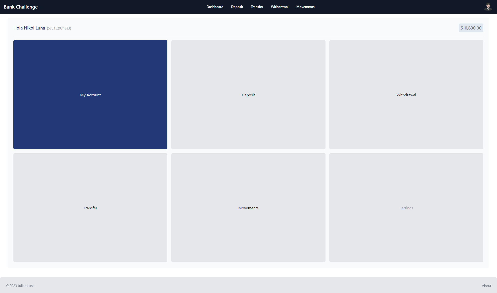
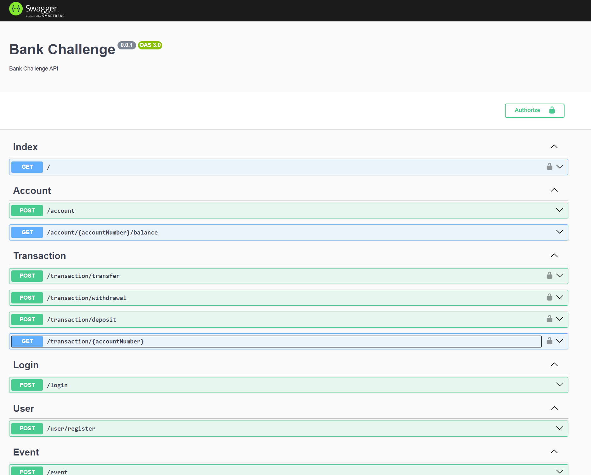

# Bank Challenge Project

This project consists of a simple banking system with a backend developed in NestJS and a frontend in Next.js.





## Key Features

- The backend is developed in NestJS and the frontend in Next.js.
- The backend runs on port `5000` and the frontend on port `3000`.
- The backend is documented with Swagger, which can be accessed at `http://localhost:5000/api-docs`.
- The frontend is developed with Next.js and can be accessed at `http://localhost:3000`.
- The backend is connected to a MySQL database running in a Docker container.
- The backend is set up to synchronize the database with the data model.
- Upon user registration, an account is generated with an initial balance of $10 (the amount can be defined from the .env file) and the account number is the registered cell phone number.
- Events were prioritized to be used through HTTP clients that decouple the modules, but the plan is to replace them with Kafka events.
- The mockup defines events that require authentication, which can also be seen in the Swagger documentation.
- The functionality to transfer money between accounts was added.
- The event log was added to the database.
- The root directory contains a document justifying the decisions made as well as the vision of the ideal solution, the document is named `Bank challenge technical decision.pdf`.

## Requirements

- Node.js
- Docker (MySQL)

## Backend - NestJS

The backend of this project is built with NestJS and runs on port `5000`.

### Getting Started

1. Clone the repository:

```
git clone [Repository URL]
```

2. Navigate to the backend directory:

```
cd backend
```

3. Install dependencies:

```
npm install
```

4. Start the server:

```
npm start
```

The server should be running at `http://localhost:5000` and the Swagger documentation at `http://localhost:5000/api-docs`.

### Docker

To set up the necessary services to work, it's essential to execute the following steps inside the `backend` folder:

```
docker-compose up
```

### Environment Variables

For the proper functioning of the backend, it is necessary to create a `.env` file in the `backend` folder with the following environment variables:

```
DATABASE_HOST=localhost
DATABASE_PORT=3306
DATABASE_USER=[your_user]
DATABASE_PASSWORD=[your_password]
MYSQL_ROOT_PASSWORD=[your_password]
DATABASE_NAME=bank
DATABASE_SYNCHRONIZE=true
ROOT_RESPONSE=Backend is running!
JWT_SECRET=[your_secret]
BALANCE_BONUS=10
APP_PORT=5000
APP_HOST=localhost
TIMEOUT=2500
```

### Insomnia Collection

To test the API endpoints, you can import the Insomnia collection found in the `resources` folder named `Insomnia_collection.json`.

## Frontend - Next.js

The frontend of this project is built with Next.js and runs on port `3000`.

### Getting Started

1. Navigate to the frontend directory:

```
cd frontend
```

2. Install dependencies:

```
npm install
```

3. Start the application:

```
npm run dev
```

The application should be running at `http://localhost:3000`.

### Questions

If you have any questions, you can write to me at `judlup@gmail.com`.

---
